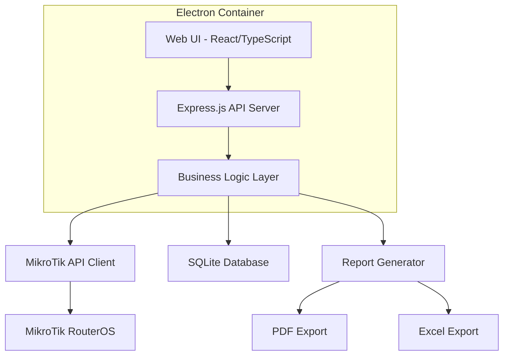

# Design Document

## Overview

The MikroTik Hotspot Management Platform is designed as a Windows desktop application using a modern web-based UI packaged with Electron for cross-platform compatibility and ease of development. The architecture follows a modular approach with clear separation between the presentation layer, business logic, and data access layers. The system integrates with MikroTik RouterOS through the REST API and maintains local data persistence using SQLite for the MVP phase.

## Architecture

### High-Level Architecture



### Technology Stack

- **Frontend**: React with TypeScript, Material-UI for professional design
- **Backend**: Node.js with Express.js for API server
- **Database**: SQLite for MVP (designed for easy migration to PostgreSQL/MySQL)
- **Desktop Framework**: Electron for Windows packaging
- **MikroTik Integration**: RouterOS REST API client
- **Authentication**: JWT tokens with bcrypt password hashing
- **Reporting**: jsPDF for PDF generation, ExcelJS for Excel exports

## Components and Interfaces

### Core Components

#### 1. Authentication Service
```typescript
interface AuthService {
  login(username: string, password: string): Promise<AuthResult>
  logout(token: string): Promise<void>
  validateToken(token: string): Promise<UserSession>
  hashPassword(password: string): Promise<string>
}

interface UserSession {
  userId: string
  username: string
  role: UserRole
  permissions: Permission[]
  expiresAt: Date
}
```

#### 2. MikroTik API Client
```typescript
interface MikroTikClient {
  connect(host: string, username: string, password: string): Promise<void>
  createHotspotUser(user: HotspotUser): Promise<string>
  updateHotspotUser(userId: string, updates: Partial<HotspotUser>): Promise<void>
  deleteHotspotUser(userId: string): Promise<void>
  getActiveUsers(): Promise<ActiveUser[]>
  getUserSessions(): Promise<UserSession[]>
  disconnect(): Promise<void>
}

interface HotspotUser {
  name: string
  password: string
  profile?: string
  macAddress?: string
  comment?: string
  disabled: boolean
}
```

#### 3. User Management Service
```typescript
interface UserManagementService {
  createUser(userData: CreateUserRequest): Promise<User>
  updateUser(userId: string, updates: UpdateUserRequest): Promise<User>
  deleteUser(userId: string): Promise<void>
  getUserById(userId: string): Promise<User>
  getAllUsers(filters?: UserFilters): Promise<User[]>
  disableUser(userId: string): Promise<void>
  enableUser(userId: string): Promise<void>
}
```

#### 4. Voucher Management Service
```typescript
interface VoucherService {
  generateVouchers(request: VoucherGenerationRequest): Promise<Voucher[]>
  createBillingPlan(plan: BillingPlan): Promise<string>
  updateBillingPlan(planId: string, updates: Partial<BillingPlan>): Promise<void>
  exportVouchersPDF(vouchers: Voucher[]): Promise<Buffer>
  exportVouchersExcel(vouchers: Voucher[]): Promise<Buffer>
}

interface VoucherGenerationRequest {
  quantity: number
  billingPlanId: string
  prefix?: string
  validityPeriod: number
  dataLimit?: number
}
```

#### 5. Monitoring Service
```typescript
interface MonitoringService {
  getActiveUsers(): Promise<ActiveUserInfo[]>
  getBandwidthUsage(timeRange: TimeRange): Promise<BandwidthData[]>
  getUserSessionLogs(filters?: LogFilters): Promise<SessionLog[]>
  getSystemStats(): Promise<SystemStats>
}

interface ActiveUserInfo {
  username: string
  ipAddress: string
  macAddress: string
  uptime: number
  bytesIn: number
  bytesOut: number
  sessionStart: Date
}
```

#### 6. Reporting Service
```typescript
interface ReportingService {
  generateUserReport(params: ReportParameters): Promise<UserReport>
  generateRevenueReport(params: ReportParameters): Promise<RevenueReport>
  generateUsageReport(params: ReportParameters): Promise<UsageReport>
  exportReportPDF(report: Report): Promise<Buffer>
  exportReportExcel(report: Report): Promise<Buffer>
}

interface ReportParameters {
  startDate: Date
  endDate: Date
  reportType: ReportType
  filters?: ReportFilters
}
```

## Data Models

### Database Schema

#### Users Table
```sql
CREATE TABLE users (
  id INTEGER PRIMARY KEY AUTOINCREMENT,
  username VARCHAR(50) UNIQUE NOT NULL,
  password_hash VARCHAR(255) NOT NULL,
  role VARCHAR(20) NOT NULL,
  created_at DATETIME DEFAULT CURRENT_TIMESTAMP,
  updated_at DATETIME DEFAULT CURRENT_TIMESTAMP,
  is_active BOOLEAN DEFAULT 1
);
```

#### Hotspot Users Table
```sql
CREATE TABLE hotspot_users (
  id INTEGER PRIMARY KEY AUTOINCREMENT,
  username VARCHAR(50) UNIQUE NOT NULL,
  password VARCHAR(50) NOT NULL,
  mac_address VARCHAR(17),
  billing_plan_id INTEGER,
  created_at DATETIME DEFAULT CURRENT_TIMESTAMP,
  expires_at DATETIME,
  data_limit_mb INTEGER,
  is_active BOOLEAN DEFAULT 1,
  voucher_id INTEGER,
  FOREIGN KEY (billing_plan_id) REFERENCES billing_plans(id),
  FOREIGN KEY (voucher_id) REFERENCES vouchers(id)
);
```

#### Billing Plans Table
```sql
CREATE TABLE billing_plans (
  id INTEGER PRIMARY KEY AUTOINCREMENT,
  name VARCHAR(100) NOT NULL,
  description TEXT,
  duration_hours INTEGER,
  data_limit_mb INTEGER,
  price DECIMAL(10,2),
  created_at DATETIME DEFAULT CURRENT_TIMESTAMP,
  is_active BOOLEAN DEFAULT 1
);
```

#### Vouchers Table
```sql
CREATE TABLE vouchers (
  id INTEGER PRIMARY KEY AUTOINCREMENT,
  code VARCHAR(50) UNIQUE NOT NULL,
  username VARCHAR(50) NOT NULL,
  password VARCHAR(50) NOT NULL,
  billing_plan_id INTEGER NOT NULL,
  created_at DATETIME DEFAULT CURRENT_TIMESTAMP,
  used_at DATETIME,
  expires_at DATETIME,
  is_used BOOLEAN DEFAULT 0,
  FOREIGN KEY (billing_plan_id) REFERENCES billing_plans(id)
);
```

#### Session Logs Table
```sql
CREATE TABLE session_logs (
  id INTEGER PRIMARY KEY AUTOINCREMENT,
  username VARCHAR(50) NOT NULL,
  ip_address VARCHAR(15),
  mac_address VARCHAR(17),
  session_start DATETIME,
  session_end DATETIME,
  bytes_in BIGINT DEFAULT 0,
  bytes_out BIGINT DEFAULT 0,
  disconnect_reason VARCHAR(50)
);
```

#### Admin Activity Logs Table
```sql
CREATE TABLE admin_logs (
  id INTEGER PRIMARY KEY AUTOINCREMENT,
  admin_username VARCHAR(50) NOT NULL,
  action VARCHAR(100) NOT NULL,
  target_resource VARCHAR(100),
  details TEXT,
  ip_address VARCHAR(15),
  created_at DATETIME DEFAULT CURRENT_TIMESTAMP
);
```

## Error Handling

### Error Categories

1. **Network Errors**: MikroTik router connectivity issues
2. **Authentication Errors**: Invalid credentials, expired tokens
3. **Validation Errors**: Invalid input data, constraint violations
4. **Database Errors**: Connection issues, constraint violations
5. **System Errors**: File system access, memory issues

### Error Response Format
```typescript
interface ErrorResponse {
  error: {
    code: string
    message: string
    details?: any
    timestamp: string
    requestId: string
  }
}
```

### Error Handling Strategy

- **Graceful Degradation**: Continue operation with limited functionality when MikroTik is unavailable
- **Retry Logic**: Automatic retry for transient network errors with exponential backoff
- **User Feedback**: Clear error messages with suggested actions
- **Logging**: Comprehensive error logging for debugging and monitoring
- **Fallback Modes**: Local-only operation when router connection fails

## Testing Strategy

### Unit Testing
- **Coverage Target**: 80% code coverage minimum
- **Framework**: Jest for JavaScript/TypeScript testing
- **Focus Areas**: Business logic, data validation, API clients
- **Mocking**: Mock MikroTik API responses for consistent testing

### Integration Testing
- **Database Integration**: Test with actual SQLite database
- **API Integration**: Test complete request/response cycles
- **MikroTik Integration**: Test with MikroTik simulator or test router

### End-to-End Testing
- **Framework**: Playwright for Electron app testing
- **Scenarios**: Complete user workflows from login to report generation
- **Performance Testing**: Load testing with simulated user data

### Security Testing
- **Authentication**: Test JWT token handling and expiration
- **Authorization**: Verify role-based access controls
- **Input Validation**: Test against SQL injection and XSS attacks
- **Password Security**: Verify proper hashing and storage

### Performance Testing
- **Load Testing**: Test with 10,000+ user records
- **Memory Usage**: Monitor memory consumption during operation
- **API Response Times**: Ensure sub-second response times
- **Database Performance**: Test query performance with large datasets

## Security Considerations

### Authentication & Authorization
- JWT tokens with 24-hour expiration
- Bcrypt password hashing with salt rounds of 12
- Role-based access control with principle of least privilege
- Session management with automatic logout

### Data Protection
- Encrypted storage of sensitive configuration data
- Secure transmission of credentials to MikroTik router
- Input sanitization to prevent injection attacks
- Audit logging of all administrative actions

### Network Security
- HTTPS communication with MikroTik router when available
- Certificate validation for secure connections
- Rate limiting on API endpoints
- Protection against brute force attacks

## Deployment Architecture

### Application Structure
```
mikrotik-hotspot-platform/
├── src/
│   ├── main/           # Electron main process
│   ├── renderer/       # React frontend
│   ├── api/           # Express.js backend
│   ├── services/      # Business logic services
│   ├── models/        # Data models and database
│   └── utils/         # Utility functions
├── resources/         # Application resources
├── dist/             # Built application
└── installer/        # Installation package files
```

### Configuration Management
- Environment-based configuration files
- Secure storage of MikroTik credentials
- User-configurable settings through UI
- Database connection string management

### Installation & Updates
- NSIS installer for Windows
- Automatic database migration scripts
- Configuration backup and restore
- Update mechanism for future versions